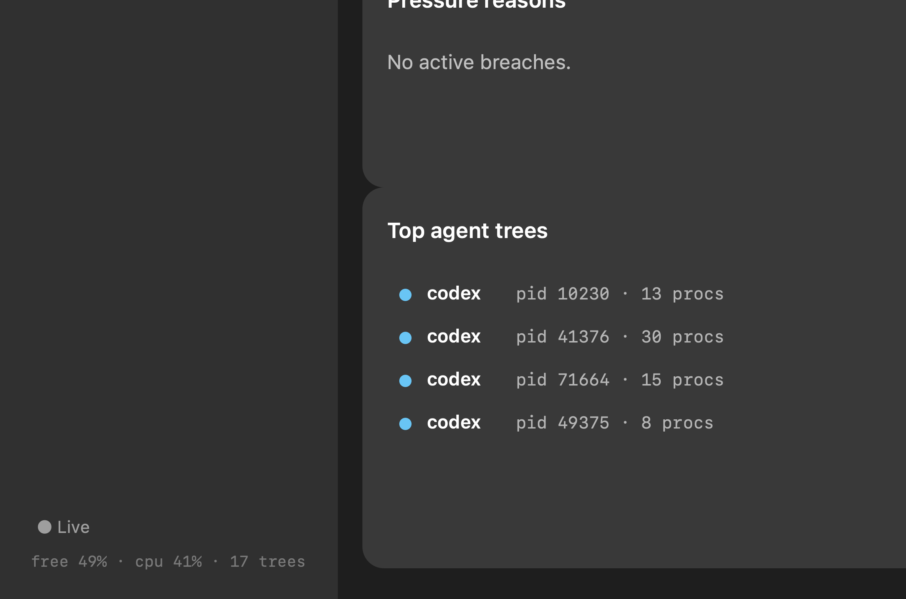

# NDev Pressure

Native macOS desktop app for visualizing and controlling **`ndev session pressure`** — the host memory/CPU pressure guard and internal-SSD write watchdog. It accounts for complete Codex / Claude / Grok / Kimi process trees, gates launches at red, coordinates weighted heavy work, and can gracefully shed one old quiescent tree at sustained critical.



## Why this app

- **High performance**: pure SwiftUI + AppKit, no Electron/Tauri/Node runtime.
- **Low storage impact**: no app-local database; the resident emits at most one bounded disk-write checkpoint per hour into the existing owner-only `~/.nicos-dev/session-pressure/` directory.
- **Control-plane honest**: shells out to `ndev --json session pressure …` for every read and mutation. Sampling and policy authority stay in the Go guard.
- **Bounded failure behavior**: each CLI request has a hard timeout and an in-memory, continuously drained byte ceiling, so a stuck or noisy control-plane child cannot wedge the app or create polling temp-file churn.
- **Operator-friendly**: hover tooltips on metrics, levels, policy actions, trees, and work leases.

## Features

| Pane | What you get |
|------|----------------|
| **Overview** | Used-memory ring (fill = 100 − free; color is policy level), free mem / host CPU / memory momentum, privacy-safe whole-host consumers, admission, prevention coverage, guard budgets, top trees, work capacity |
| **Agent Trees** | Sortable/filterable inventory with RSS, age, CPU, session IDs |
| **Disk Writes** | Internal-SSD device rate and 15m/24h totals, adaptive anomaly confidence, likely process writers, bounded hourly history, policy controls, and operator-confirmed path tracing |
| **Work Queue** | Shared capacity bar, active leases, waiter queue (2.5s busy / 10s idle visible focus poll), class weights, unconfirmed **Run now** / **Run all** queue promotion, and a lifecycle detail drawer that retains completed work as read-only history |
| **Policy** | Full protection / admission-only / observe-only, thresholds, budgets |
| **Monitor** | LaunchAgent install/status/uninstall, resident health, sample cost, copy-only unclean-start recovery evidence |
| **Idle Cleanup** | Exact PID+session graceful SIGTERM (operator-confirmed, revalidated by CLI) |
| **Telemetry** | Bounded state transitions, heartbeats, audited relief actions |

Process CPU is measured from native cumulative CPU-time deltas using stable
PID/start-time identity. A real zero is distinct from unavailable evidence;
the UI shows unavailable values as `sampling`, and cleanup/automatic relief
fail closed until current evidence exists.

Disk writes keep two scopes explicit: the global counter is internal solid-state
block-device traffic, while process attribution is best-effort disk I/O across
all mounted volumes. The model therefore says "likely contributor," never exact
SSD attribution or NAND wear. It learns per-workload quiet baselines before it
can alert and never changes pressure level, admission, or process authority.

Also: **menu bar extra** with level badge, compact metrics, and quick access to the confirmed policy controls; dock badge at warning/red/critical. The compact surface never changes process authority directly.

## Build & run

```bash
cd apps/desktop/ndev-pressure
make build      # release .app under .build/release/
make run        # install to /Applications and open
make test       # unit tests (JSON decode, formatters, policy labels)
make install    # copy to /Applications
# production trace-capable package:
make build CODE_SIGN_IDENTITY="Developer ID Application: Your Team (TEAMID)"
```

Requirements: macOS 14+, Swift 6 toolchain, `ndev` on `PATH` (or `NDEV_BIN` / `NDEV_PATH`). Observation needs no privileged helper. The optional 5–30 second file-path trace requires operator approval of the bundled, signed launch daemon; unsigned/ad-hoc development packaging is not production trace readiness.

## Documentation in this package

| Doc | Contents |
|-----|----------|
| [docs/architecture.md](docs/architecture.md) | Process model, packages, refresh strategy, privacy |
| [docs/operator-guide.md](docs/operator-guide.md) | Daily use, shortcuts, safety, troubleshooting |
| [AGENTS.md](AGENTS.md) | Agent constraints for future edits |
| [docs/screenshots/](docs/screenshots/) | UI evidence |

## CLI contracts used

| Call | Role |
|------|------|
| `ndev --json session pressure status` | Compact resident/operator health; add `--full` for prevention coverage + complete latest monitor sample |
| `ndev --json session pressure snapshot` | Explicit live sample (`⌘⇧R`) |
| `ndev --json session pressure check` | Admission decision |
| `ndev --json session pressure policy show\|enable\|observe\|init` | Policy controls |
| `ndev --json session pressure work status` | Weighted capacity |
| `ndev --json session pressure work override --operation-id ID --confirm` | One-shot operator queue-priority override |
| `ndev --json session pressure work override --all --confirm` | Pin the whole queue as one ordered promotion sequence |
| `ndev --json session pressure work override --clear --confirm` | Release the pinned sequence back to ordinary policy |
| `ndev --json session pressure board [--include ...]` | One composite read: status + work + admission (+ opt-in sections) |
| `ndev --json session pressure io status [--live] [--full]` | Resident adaptive state; `--live` composes it with one bounded fresh rate/writer sample |
| `ndev --json session pressure io top [--live] [--limit 5]` | Persisted lead by default; bounded multi-writer attribution with `--live` |
| `ndev --json session pressure io history --since 24h --limit 20` | Hourly aggregate history |
| `ndev --json session pressure io policy …` | Observe/notify/disable controls; alerts are explicit opt-in |
| `ndev --json session pressure io trace --pid PID` | Revalidated deep-link handoff to the interactive trace helper |
| `ndev --json session pressure monitor status\|install\|uninstall\|once` | LaunchAgent lifecycle |
| `ndev --json session pressure idle` / `--apply` | Idle inventory + confirmed cleanup |
| `ndev --json session pressure telemetry` | Sparse history |

## Architecture (short)

```
┌──────────────────────┐   ndev --json    ┌─────────────────────────┐
│  NDev Pressure.app   │ ───────────────► │  ndev session pressure  │
│  SwiftUI + menubar   │                  │  resident + CLI         │
└──────────┬───────────┘                  └───────────┬─────────────┘
           │ operator-approved XPC                    │ native IOKit/libproc
           ▼                                          ▼
  bounded trace helper                    ~/.nicos-dev/session-pressure/
  (interactive only)                      policy · latest · hourly history
```

Adaptive UI poll: ~20s normal, faster under warning/red/critical, backing off to 60s compact when the main window is closed and only the menu-bar extra is rendering. Every board refresh is a **single** `ndev session pressure board` process — status, work, and admission always, with pane-aware doctor, calibration, policy, monitor, idle, and telemetry sections requested in the same read and prior detail reused. The visible, active Work Queue pane adds a work-status-only poll (~2.5s busy / 10s empty). The Disk Writes pane takes one bounded live report every 15s and refreshes hourly history no more often than every five minutes. Focus reads stop while the app or window is inactive/minimized; the board poll never stops while the app is running.

## Catalog

- Feature catalog seed: `product.ndev-pressure` (`nicos-dev/config/catalog-seeds.yaml`)
- Software catalog component: `context.ndev-pressure` (`catalog.yaml`)
- Bridges to: `session.pressure` (CLI / LaunchAgent control plane)

## Related

- KEP: `docs/active/07-13-1448-session-host-pressure-guard/session-host-pressure-guard-kep.md`
- SSD watchdog KEP: `docs/active/07-22-1704-session-pressure-ssd-write-watchdog/session-pressure-ssd-write-watchdog-kep.md`
- Core package: `nicos-dev/internal/sessionpressure`
- CLI: `ndev session pressure --help`
